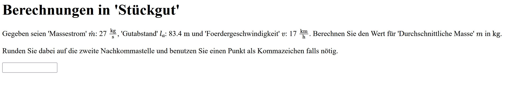

# Manual for template Input Equation Value
The task is to input the solution for a given Formula.

Type: number Input

Required FDL Type: Equation (Eq)

###Parameters:
difficulty: If the difficulty is greater than 5 then the solution can belong to a variable on the right side 

### Example:

# Manual for template Input Figure Labels
For this task an image with labels is given. The task is to assign the terms to the labels.

Type: Input

Required FDL Type: Figure (Fig)

###Parameters: 
difficulty: If the difficulty is greater than 9, the terms are not given.

###Example:

# Manual for template Select Character
The task is to Select the correct Characters for a specific topic from a Selection.

Type: Multiple Choice

Required FDL Type: Character (Char)

###Parameters:

difficulty: By increasing the difficulty the number of possibilities is getting higher and the wrong answers are closer to the correct ones.

###Example:

# Manual for template Select Correct Formula
The task is to select the correct Formula to a given topic

Type: Single Choice

Required FDL Type: Equations (Eq)

###Example:

# Manual for template Select Examples
The task is to Select the correct Examples for a specific topic from a Selection.

Type: Multiple Choice

Required FDL Type: Examples (Ex)

###Parameters:

difficulty: By increasing the difficulty the number of possibilities is getting higher and the wrong answers are closer to the correct ones.

###Example:

# Manual for template Text Completion
A Text with gaps is given. The task is to fill in the gaps.

Type: Text Input

Required FDL Type: Definition (Def)

###Parameters:

difficulty: The minimum number of gaps is 6. Increasing the difficulty leads to an increased amount of gaps.

###Example:

# Manual for template Input Hierarchy Labels
A hierarchical tree with gaps is given. The task is to fill in the gaps.

Type: Text Input

Required FDL Type: Hierarchy (Hie)

###Parameters:

difficulty: The difficulty * 0,1 is the percentage of nodes which are blank.

###Example:

# Manual for template Put in Sequence
For this task a number of terms are given. The terms represent the steps of a specific sequence. The task is to input the number, starting with 1, which the term has in the sequence.

Type: Number Input

Required FDL Type: Sequence (Seq)

###Parameters:

difficulty: Low difficulty means that most of the numbers are given. Consequently, at a difficulty of ten no number is given.

###Example:

# Manual for template Select Example Images
The task is to Select the correct example Images for a specific topic from a Selection.

Type: Multiple Choice

Required FDL Type: Examples (Ex)

###Parameters:

difficulty: By increasing the difficulty the amount of correct answers increases.

###Example:

# Manual for template Select Pattern
For this task a selection of patterns are given. The task is to select the correct patterns for the given topic.

Type: Multiple Choice

Required FDL Type: Pattern (Pa)

###Parameters:

difficulty: By increasing the difficulty the amount of correct answers increases.

###Example:

# Manual for template Select Solution for Equation
The task is to select the correct solution for missing variable.

Type: Single Choice

Required FDL Type: Equations (Eq)

###Example:

# Manual for template Select Unit Variable
The task is to select the correct unit for the variable.

Type: Single Choice

Required FDL Type: Equations (Eq)

###Example:

# Manual for template Select Vantage
The task is to select the vantages for the specific topic.

Type: Multiple Choice

Required FDL Type: Trade Off (To)

###Example:

# Manual for template Select Unit
The task is to select the Unit for a Variable.

Type: Single Choice

Required FDL Type: Equation (Eq)

###Example:

